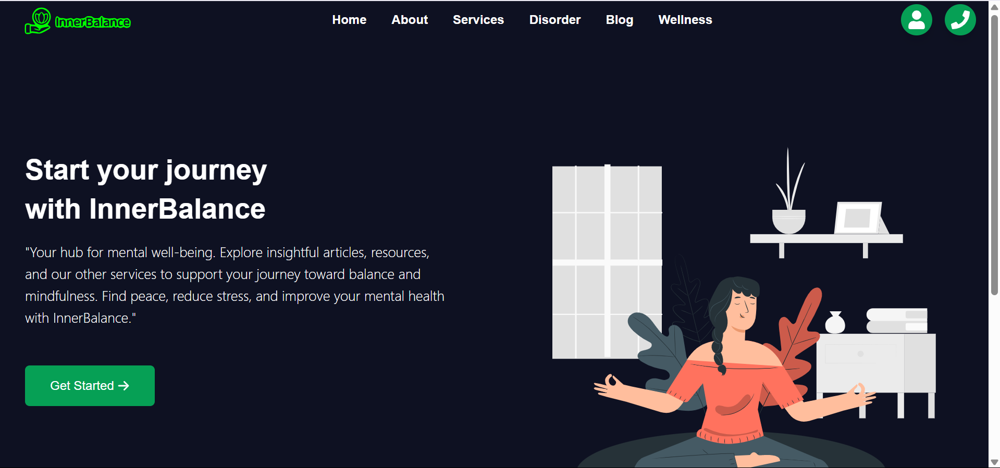
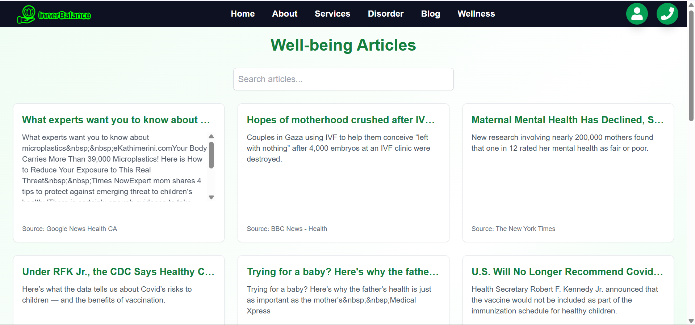
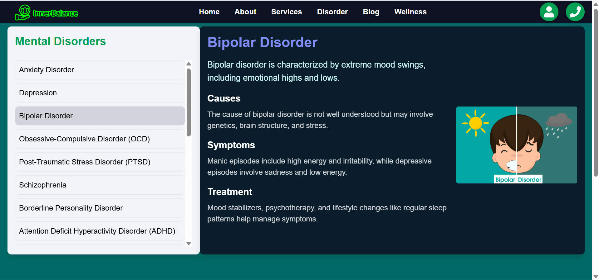
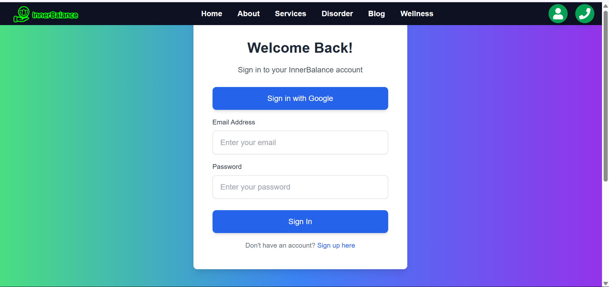
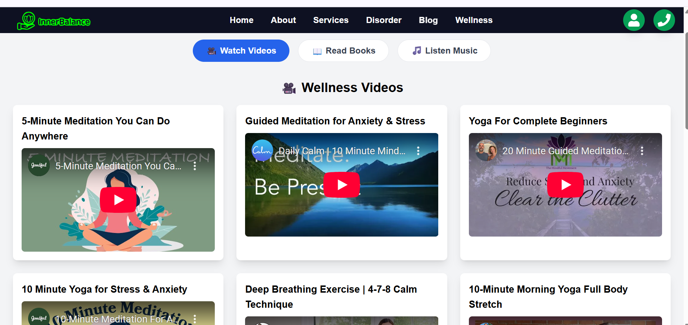
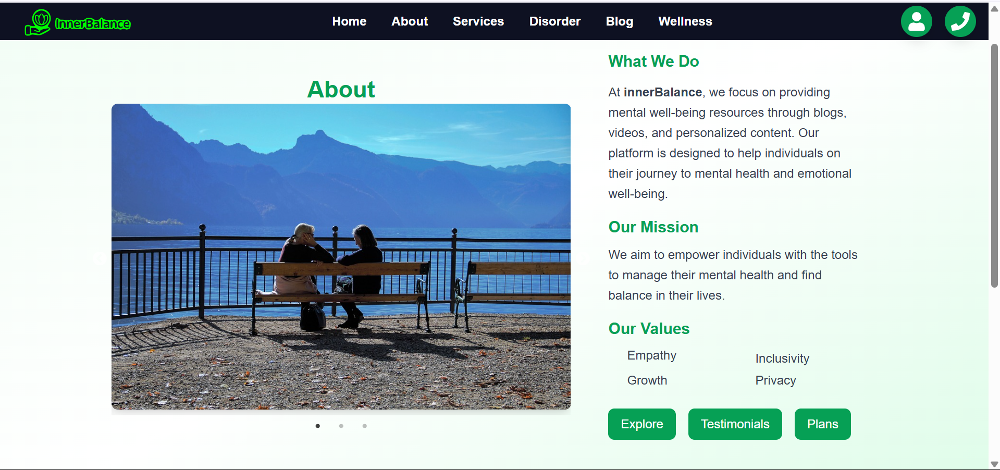

# 🌿 InnerBalance - Frontend

**InnerBalance** is a wellness platform focused on improving mental, physical, and emotional health. This repository contains the frontend part of the application built using **React** and **Vite**.

---
## 🚀 Live Demo

 [Demo](https://innerbalance45.netlify.app/)

## 🚀 Features

- mental wellness content
- Blog article search with backend API support
- UI components for books, audiobooks, and video exercises
- Google authentication integration 
- Responsive design using modern web technologies

---

## 🛠️ Tech Stack

- [React](https://reactjs.org/)
- [Vite](https://vitejs.dev/)
- [Bootstrap](https://getbootstrap.com/)
- [React Router](https://reactrouter.com/)
- [Axios](https://axios-http.com/)
- [Firebase ](https://firebase.google.com/)

---

##  ScreenShot

### 🏠 Home Page  


### 📰 Blog Page  


### 🧠 Disorder Page  


### 🔐 Signup Page  


### 🌿 Wellness Page  


### ℹ️ About Page  



### 1. Clone the Repository
```bash
git clone https://github.com/your-username/innerBalance-frontend.git
cd innerBalance-frontend
npm install
npm run dev

This will start the app at http://localhost:5173


